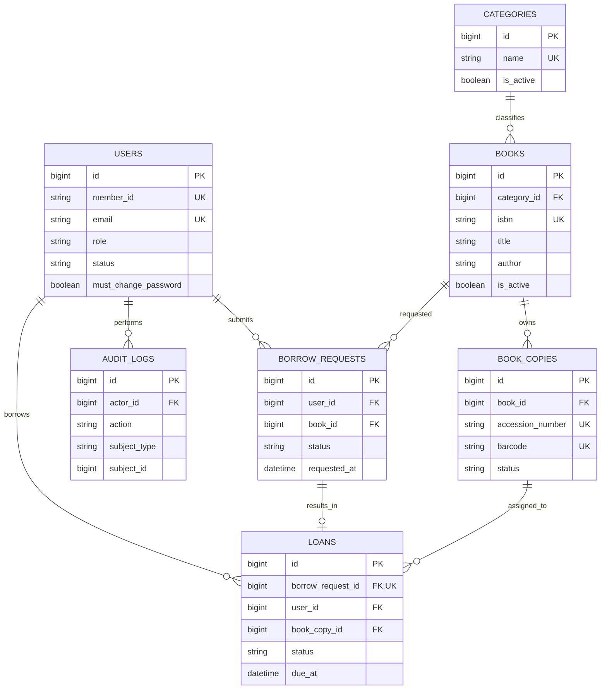

# Library Management System ERD

```mermaid
erDiagram
    USERS ||--o{ BORROW_REQUESTS : submits
    USERS ||--o{ LOANS : borrows
    USERS ||--o{ AUDIT_LOGS : performs
    CATEGORIES ||--o{ BOOKS : classifies
    BOOKS ||--o{ BOOK_COPIES : owns
    BOOKS ||--o{ BORROW_REQUESTS : requested
    BORROW_REQUESTS ||--o| LOANS : results_in
    BOOK_COPIES ||--o{ LOANS : assigned_to

    USERS {
        bigint id PK
        string member_id UK
        string email UK
        string role
        string status
        boolean must_change_password
    }
    CATEGORIES {
        bigint id PK
        string name UK
        boolean is_active
    }
    BOOKS {
        bigint id PK
        bigint category_id FK
        string isbn UK
        string title
        string author
        boolean is_active
    }
    BOOK_COPIES {
        bigint id PK
        bigint book_id FK
        string accession_number UK
        string barcode UK
        string status
    }
    BORROW_REQUESTS {
        bigint id PK
        bigint user_id FK
        bigint book_id FK
        string status
        datetime requested_at
    }
    LOANS {
        bigint id PK
        bigint borrow_request_id FK,UK
        bigint user_id FK
        bigint book_copy_id FK
        string status
        datetime due_at
    }
    AUDIT_LOGS {
        bigint id PK
        bigint actor_id FK
        string action
        string subject_type
        bigint subject_id
    }
```

Laravel's standard `notifications` table stores polymorphic User notifications, and `personal_access_tokens` stores Sanctum bearer tokens.
